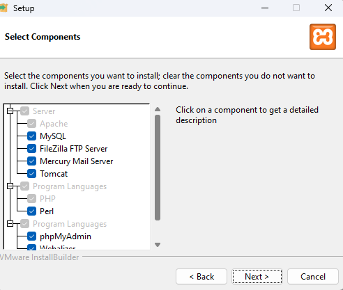

# Proyecto Neatbeans Interfaces Graficas (Cerveceria)

El repositrio es corresponde a un proyecto de interfaces graficas el cual tiene la finalidad de plasmar un sistema de compra venta de un negocio local, en este caso con una cerveceria en donde se abordan temas de inventario, productos etc

# Como ejecutar este proyecto

1. Instalar el jdk (Esta aplicacion permite ejecutar los paquetes necesarios para la ejecucion de neatbeans)

1.1 [Descarga de jdk](https://www.oracle.com/mx/java/technologies/downloads/#jdk21-windows)

2. Instalar Neatbeans

2.1 [Descargar Neatbeans](https://netbeans.apache.org/front/main/)

3. Instalar XAMPP

3.1 [Descargar XAMPP](https://www.apachefriends.org/es/index.html)

 3.2 Recuerda colocar estas opciones habilitadas 

4. Deberas de abrir Xampp y activar 
 
4.1 Apache

4.2 MYSQL

>.[!NOTE].
5. El archivo papeleria.sql contiene una pequeña base de datos 

5.1 Usa la opcion importar en los ajuster de PHPMYADMIN para obtener la informacion de este proyecto papeleria

6. Abre el proyecto 
    
    El proyecto contiene la siguiente informacion 
    -Login
    -Proveedores
    -Inventario
    -Entradas 
    -Salida 
>.[!IMPORTANT].

Las credenciales de acceso a el proyecto son las siguiente 

Usuario: Usuario
Contraseña: contraseña1

